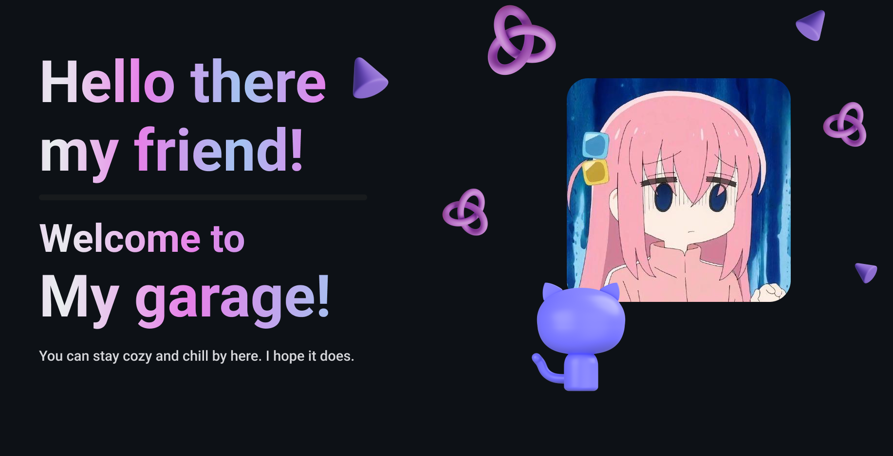

## Hi there 👋

- 🔭 **I’m currently learning on** Pukyong National University on Korea, Republic of.
- 🌱 **I’m currently learning** Japanese!!
- 👯 **I’m looking to collaborate on** AI!!
- 🤔 **I’m looking for help with** comments for what I've done so far.
- 💬 **Ask me about** what are you into these days?
- 📫 **How to reach me**: bocchithecoding@gmail.com
- 😄 **Pronouns**: Jae-Min, as it be written.
- ⚡ **Fun fact**: I love opensource community :>

## 🔨 My main stacks 🔨

